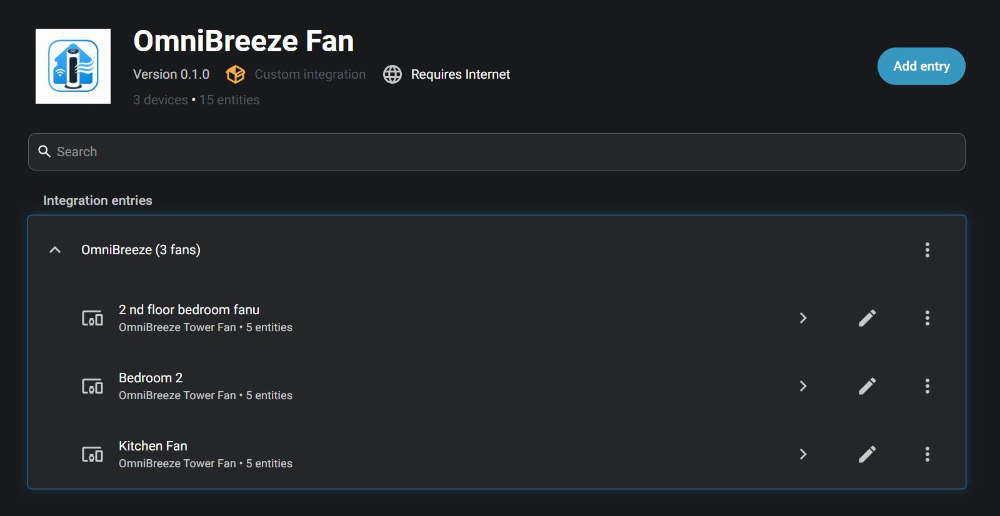
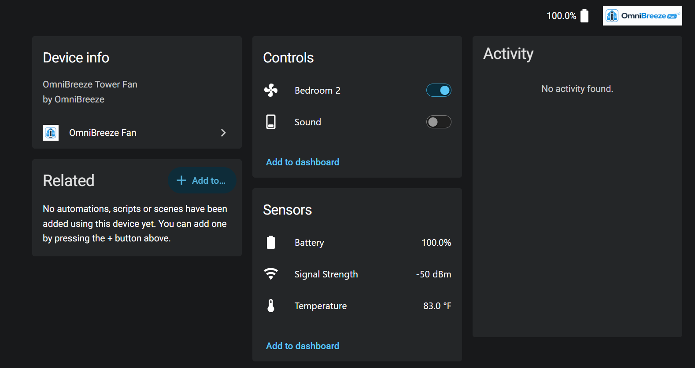
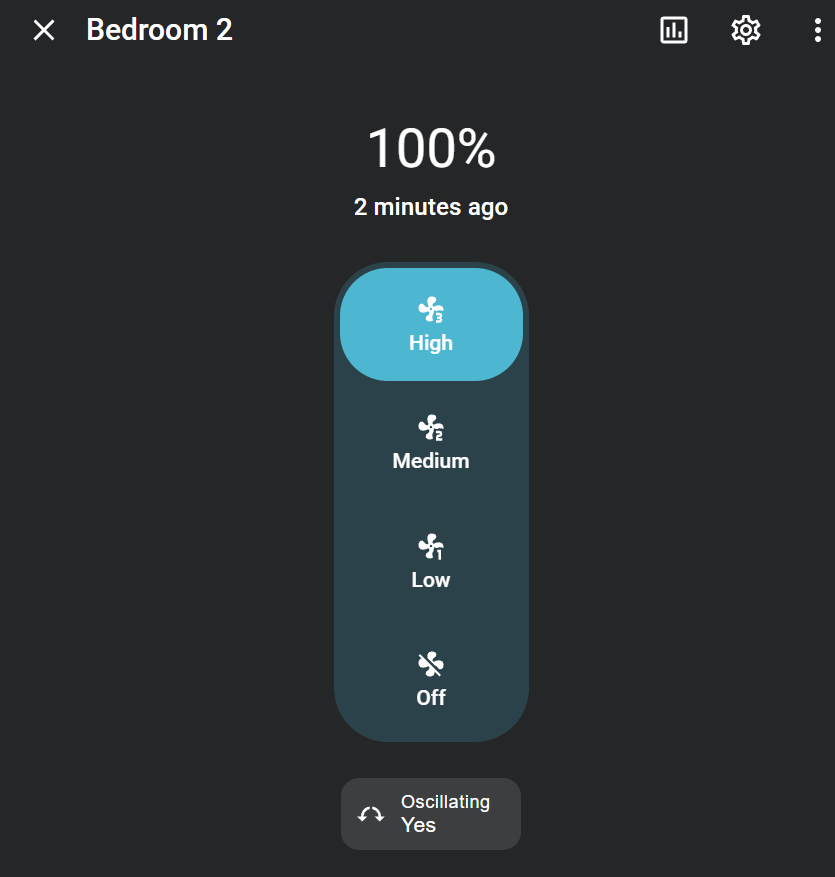

  

# OmniBreeze Home Assistant Integration

Unofficial Home Assistant custom integration for the Costco OmniBreeze Wi-Fi Tower Fan.

This integration lets Home Assistant discover and control OmniBreeze fans that use the Landbook / NetPrisma app, without running a separate Docker bridge.

## Quick install

Click the button above on a device that has access to your Home Assistant instance. It opens the **Add custom repository** dialog in HACS with this repository pre-filled.

After installing:

1. Restart Home Assistant.
2. Go to **Settings → Devices & services → Add integration**.
3. Search for **OmniBreeze Fan**.
4. Sign in with your Landbook / NetPrisma account.

## Requirements

- Home Assistant 2024.8 or newer
- HACS installed
- A working Landbook / NetPrisma account
- At least one OmniBreeze Wi-Fi fan already paired with your account
- Internet access

## What it does

- Creates native Home Assistant fan entities
- Discovers fans automatically from your Landbook / NetPrisma account
- Supports power on/off
- Supports 3-speed fan control
- Supports oscillation control
- Adds a sound/beep switch
- Adds auto-mute on integration startup
- Adds temperature, battery, signal strength, and online status entities
- Adds an options menu for scan interval and auto-mute
- Uses Home Assistant's normal UI setup flow

## Important note

This is not fully local.

The fans still use the stock Landbook / NetPrisma cloud connection. This integration talks to the same cloud service directly from Home Assistant.

There is no separate dashboard, no Docker bridge, and no YAML REST template setup required.

## Setup

After restarting Home Assistant:

1. Go to **Settings**.
2. Go to **Devices & services**.
3. Click **Add integration**.
4. Search for **OmniBreeze Fan**.
5. Enter your Landbook / NetPrisma account details.

Default US user domain:

    U.SP.8589934603

The default US NetPrisma user domain secret is pre-filled during setup. Most US users should not need to change it.

## Created entities

For each fan, Home Assistant creates a device with entities similar to:

    fan.kitchen_fan
    sensor.kitchen_fan_temperature
    sensor.kitchen_fan_battery
    sensor.kitchen_fan_signal_strength
    binary_sensor.kitchen_fan_online
    switch.kitchen_fan_sound

Entity names depend on the fan names in your Landbook / NetPrisma account.

## Options

The integration includes an options menu under:

    Settings → Devices & services → OmniBreeze Fan → Configure

Current options:

- Scan interval
- Auto mute fan sound on startup
- Show diagnostic sensors

## Auto mute

The integration can send `sound_off` once when it starts.

This helps reduce the annoying fan beep when possible. It does not send an extra mute command after every control action because that can cause double beeps.

If the user manually turns the sound switch back on, the integration leaves it on until the next Home Assistant or integration restart.

## Fan modes

The Landbook app has fan modes:

- Normal
- Natural
- Sleep
- Auto

Mode support is still being tested. Some captured packets appear to be status updates instead of working control commands, so mode control may not work reliably yet.

## Screenshots

### Integration devices

### Home Assistant entities

### Fan controls

## Related project: Docker dashboard

This HACS integration is for users who want native Home Assistant entities without running a separate bridge.

The original Docker dashboard and REST API bridge are available here:

**OmniBreeze Fan Dashboard**  
https://github.com/abdoomaster/OmniBreeze-fan-dashboard

Use the Docker dashboard if you want:

- A standalone local web dashboard
- A REST API bridge
- Docker Compose deployment
- Home Assistant YAML examples
- A setup that can also be used outside Home Assistant

## Known limitations

- Requires internet access
- Depends on the Landbook / NetPrisma cloud API
- May break if the vendor changes login, API endpoints, MQTT behavior, or app signing
- Fan mode control is still experimental
- Currently tested with the Costco OmniBreeze Wi-Fi Tower Fan

## Troubleshooting

### The integration does not appear in Home Assistant

Restart Home Assistant after installing through HACS.

### Config flow could not be loaded

Check Home Assistant logs for `omnibreeze` errors. This usually means a missing dependency, an old copied file, or a bad custom component install.

### Fan controls work but state is delayed

The integration polls the cloud API. State may take a few seconds to refresh.

### Beep still happens

The integration turns the fan sound setting off on startup. Some beep behavior may still be controlled by the fan firmware and may not be fully suppressible.

### Mode always goes back to Normal

Mode support is still experimental. The app packets captured so far may be state reports rather than valid control commands.

## Disclaimer

This is an unofficial community integration. It is not affiliated with OmniBreeze, Costco, Landbook, or NetPrisma.

## Fan speed count

By default, the integration assumes a 3-speed fan.

Some OmniBreeze models, such as 5-speed tower fans, support more speeds. To expose those speeds in Home Assistant, set this environment variable for your Home Assistant container:

    OMNIBREEZE_FAN_SPEED_COUNT=5

If unset, the integration defaults to:

    OMNIBREEZE_FAN_SPEED_COUNT=3

The value is clamped between `1` and `12`.
