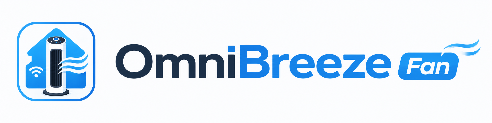

  

# OmniBreeze Home Assistant Integration

Unofficial Home Assistant custom integration for the Costco OmniBreeze Wi-Fi Tower Fan.

This integration lets Home Assistant discover and control OmniBreeze fans that use the Landbook / NetPrisma app, without running a separate Docker bridge.

## What it does

- Creates native Home Assistant fan entities
- Discovers fans automatically from your Landbook / NetPrisma account
- Supports power on/off
- Supports 3-speed fan control
- Supports oscillation control
- Adds a sound/beep toggle switch
- Adds temperature, battery, and signal sensors when available
- Uses Home Assistant's normal UI setup flow

## Important note

This is not fully local.

The fans still use the stock Landbook / NetPrisma cloud connection. This integration talks to the same cloud service directly from Home Assistant.

There is no separate dashboard, no Docker bridge, and no YAML REST template setup required.

## Installation with HACS

1. Open HACS in Home Assistant.
2. Go to Integrations.
3. Open the three-dot menu.
4. Choose Custom repositories.
5. Add this repository URL.
6. Select category: Integration.
7. Install OmniBreeze Fan.
8. Restart Home Assistant.

## Setup

After restarting Home Assistant:

1. Go to Settings.
2. Go to Devices & services.
3. Click Add integration.
4. Search for OmniBreeze Fan.
5. Enter your Landbook / NetPrisma account details.

Default US user domain:

    U.SP.8589934603

You also need the matching NetPrisma user domain secret used by the Landbook app.

## Created entities

For each fan, Home Assistant creates a device with entities similar to:

    fan.kitchen_fan
    sensor.kitchen_fan_temperature
    sensor.kitchen_fan_battery
    sensor.kitchen_fan_signal_strength
    switch.kitchen_fan_sound

Entity names depend on the fan names in your Landbook / NetPrisma account.

## Repository split

This repository is for the native Home Assistant / HACS integration.

The Docker dashboard and REST bridge live in the original project:

    https://github.com/abdoomaster/OmniBreeze-fan-dashboard

## Known limitations

- Requires internet access
- Depends on the Landbook / NetPrisma cloud API
- May break if the vendor changes login, API endpoints, MQTT behavior, or app signing
- Currently tested with the Costco OmniBreeze Wi-Fi Tower Fan

## Disclaimer

This is an unofficial community integration. It is not affiliated with OmniBreeze, Costco, Landbook, or NetPrisma.
